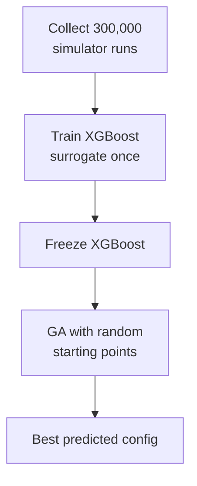

Complete definition of the ISP register optimization problem, constraints, current approach, and recommended direction.

---

## The System

An **Image Signal Processing (ISP) pipeline** implemented as a chain of C++ modules — each ISP block is a separate file. The full chain is compiled and run as a software simulator. The simulator is the ground truth — there is no real hardware involved.

**Pipeline:**

The IQ metrics are **not** computed from registers directly — they are measured on the final RGB output image after the full pipeline runs. The C++ source code does not contain the metric computation.

---

## The Optimization Problem

- **~200 registers** control the behavior of multiple ISP blocks
- **Goal:** find the register configuration that maximizes a weighted combination of image quality metrics
- **Unknown structure:** which registers affect which metrics is not known upfront
- **ISP blocks may be independent** but interactions are unknown
- **Everything runs on the simulator** — no real hardware involved

---

## The Simulator

- Runs the full ISP pipeline + IQ metric measurement end-to-end
- **The simulator is the ground truth oracle**
- **300 runs/minute** via parallel CPUs
- Each individual run takes 2–4 minutes; parallelization gives 300/min
- Throughput: 18,000 configs/hour, 432,000 configs/day

---

## Current Approach

1. Collect **300,000 simulator runs** (register configs + IQ metrics) — ~16 hours of compute
2. Train **XGBoost** surrogate once on 300k examples
3. **Freeze** XGBoost — never updated after training
4. Run **Genetic Algorithm (GA)** with random starting points over the frozen XGBoost
5. Take the best predicted config as the final output

---

## Identified Weak Points

1. **GA is wrong optimizer** for continuous 200D space — designed for discrete/combinatorial problems, converges poorly
2. **Random starting points** spread poorly in 200D
3. **Frozen surrogate** — never validated against the simulator after training; GA may explore underrepresented regions where XGBoost is wrong
4. **No feedback loop** — no mechanism to catch XGBoost errors against the true simulator
5. **Full 200D search** — most registers likely have minimal effect on metrics; searching all 200 dilutes optimization

---

## Available Assets

| Asset | Details |
|---|---|
| Training data | 300k labeled simulator runs |
| Surrogate model | XGBoost trained on 300k, with feature importance |
| Source code | C++ files for every ISP block |
| Simulator throughput | 300 runs/min, parallelized, ground truth |

---

## Recommended Approach

1. **XGBoost feature importance** → identify ~20–40 active registers from 200 (free, existing model)
2. **C++ static analysis** → eliminate dead/write-only registers (free, zero runs)
3. **Replace GA with multi-start CMA-ES** — adapts to landscape geometry, far more efficient in continuous high-D
4. **Simulator validation loop** — validate top-K CMA-ES configs on simulator (minutes at 300/min), retrain XGBoost on disagreement regions, repeat until surrogate is accurate
5. **Final output** is the simulator-validated best config

---

## Required Improvements

Three changes ranked by impact:

### 1. Replace GA with CMA-ES — highest impact, easiest change

GA is the wrong tool for continuous 200D space — designed for discrete/combinatorial problems. CMA-ES adapts its search distribution to the landscape geometry as it explores, directly addressing local optima and poor coverage. Same surrogate, drop-in replacement.

### 2. Add a Simulator Validation Loop — currently missing entirely

The current pipeline optimizes over XGBoost, takes the best config, and trusts it blindly. There is no step that checks whether XGBoost's prediction is correct at that point. With 300 runs/min, validating the top-K CMA-ES configs on the simulator costs minutes. If XGBoost is wrong in that region, resample and retrain. Right now this failure mode is invisible.

### 3. Reduce Search Space Before Optimizing — 200D is too wide

Most of the 200 registers likely have minimal effect on most metrics. Two free sources identify which ones matter:
- **XGBoost feature importance** — already computed from the existing trained model, zero new runs
- **LLM analysis of C++ files** — finds dead registers, categoricals, explicit clamps; see [[cpp-register-profiling-workflow]]

Reducing to 20–40 active registers before CMA-ES runs makes the search dramatically more efficient.

### Priority Order

Do them in this order — reduce the space first so CMA-ES operates in the right dimensions from the start.

---

## See also

- [[isp-register-optimization]]
- [[cma-es]]
- [[loshchilov-2017-lm-ma-es]]
- [[high-dimensional-bo]]
- [[surrogate-model]]
- [[bayesian-optimization]]
