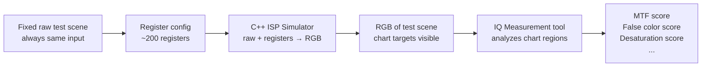
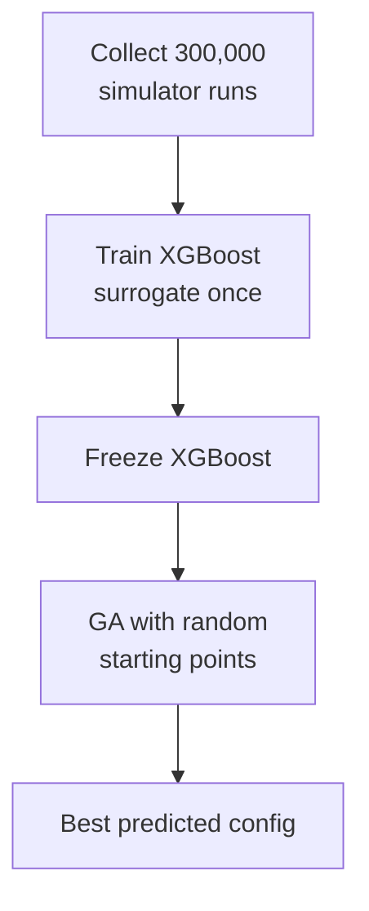
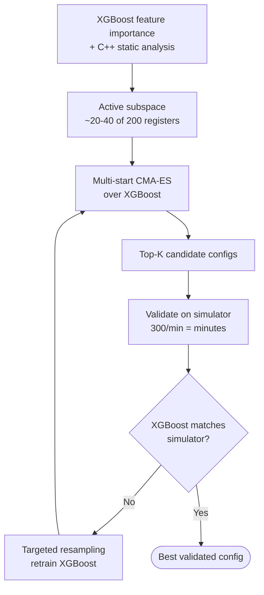

Complete definition of the ISP register optimization problem, constraints, current approach, and recommended direction.

---

## The System

An **Image Signal Processing (ISP) pipeline** implemented as a chain of C++ modules — each ISP block is a separate file. The full chain is compiled and run as a software simulator.

**Full evaluation pipeline:**

Two distinct steps:
1. **C++ ISP Simulator** — takes the fixed raw test scene + register config, outputs an RGB image. Does not compute any metrics.
2. **IQ Measurement tool** — takes the RGB image, analyzes specific chart regions (MTF chart, false color chart, desaturation chart, etc.), outputs one score per metric.

The raw input is **always the same fixed test scene** — the only variable is the register configuration. Evaluations are fully deterministic.

**Register → metric relationship is unknown.** We know which registers belong to which ISP block (from C++ source), and we have approximate domain knowledge of which blocks affect which image properties — but the actual register → IQ metric mapping must be discovered empirically via XGBoost feature importance.

---

## The Optimization Problem

- **~200 registers** control the behavior of multiple ISP blocks
- **Goal:** find the register configuration that maximizes a weighted combination of image quality metrics
- **Unknown structure:** which registers affect which metrics is not known upfront
- **ISP blocks may be independent** but interactions are unknown
- **Everything runs on the simulator** — no real hardware involved

---

## The Evaluation System

| Component | Input | Output |
|---|---|---|
| C++ ISP Simulator | Fixed raw image + register config | RGB image |
| IQ Measurement tool | RGB image | MTF, false color, desaturation, ... scores |
| **Full evaluation** | Register config | IQ metric scores |

- **300 runs/minute** via parallel CPUs — includes both simulator + IQ measurement
- Each individual run takes 2–4 minutes total; parallelization gives 300/min
- Throughput: 18,000 configs/hour, 432,000 configs/day
- The full evaluation (simulator + IQ measurement) is the ground truth oracle

---

## Current Approach

1. Collect **300,000 simulator runs** (register configs + IQ metrics) — ~16 hours of compute
2. Train **XGBoost** surrogate once on 300k examples
3. **Freeze** XGBoost — never updated after training
4. Run **Genetic Algorithm (GA)** with random starting points over the frozen XGBoost
5. Take the best predicted config as the final output

---

## Identified Weak Points

1. **GA is wrong optimizer** for continuous 200D space — designed for discrete/combinatorial problems, converges poorly
2. **Random starting points** spread poorly in 200D
3. **Train-once surrogate** — 300k broadly-sampled examples cover 200D space thinly. CMA-ES converges to a narrow high-performance region that is almost certainly underrepresented in the original training set. XGBoost accuracy is lowest exactly where it matters most.
4. **Frozen surrogate** — never updated after training; no mechanism to detect or correct prediction errors in the optimal region
5. **No feedback loop** — no mechanism to catch XGBoost errors against the true simulator
6. **Full 200D search** — most registers likely have minimal effect on metrics; searching all 200 dilutes optimization

---

## Available Assets

| Asset | Details |
|---|---|
| Training data | 300k (register config, IQ metrics) pairs — collected via simulator + IQ measurement |
| Surrogate model | XGBoost: registers → predicted IQ metrics, trained on 300k pairs |
| Source code | C++ files for every ISP block — gives register → ISP block mapping |
| Full evaluation | Simulator + IQ measurement, 300 runs/min parallelized |
| Unknown | Which registers affect which IQ metrics — discovered via XGBoost feature importance |

---

## Recommended Approach

1. **XGBoost feature importance** → identify ~20–40 active registers from 200 (free, existing model)
2. **C++ static analysis** → eliminate dead/write-only registers (free, zero runs)
3. **Replace GA with multi-start CMA-ES** — adapts to landscape geometry, far more efficient in continuous high-D
4. **Iterative surrogate retraining** — CMA-ES finds promising region → validate on simulator → add 2–5k targeted samples in that region → retrain XGBoost → repeat. Each iteration costs ~17 minutes at 300/min.
5. **Final output** is the simulator-validated best config

---

## Required Improvements

Three changes ranked by impact:

### 1. Replace GA with CMA-ES — highest impact, easiest change

GA is the wrong tool for continuous 200D space — designed for discrete/combinatorial problems. CMA-ES adapts its search distribution to the landscape geometry as it explores, directly addressing local optima and poor coverage. Same surrogate, drop-in replacement.

### 2. Switch from Train-Once to Iterative Retraining

Training XGBoost once on 300k broadly-sampled points gives good global coverage but poor accuracy in the narrow high-performance region CMA-ES will converge to. This is documented in [[koratikere-2025-snbo]] as a known limitation of train-once surrogates, and [[bartz-beielstein-2016-surrogate-bbo]] establishes iterative surrogate updating (infill strategy) as the standard practice.

**The iterative loop:**
- CMA-ES finds promising region
- Validate top-K on simulator (minutes at 300/min)
- If XGBoost is wrong → sample 2–5k targeted points in that region (~17 min)
- Retrain XGBoost on 300k + targeted points
- Repeat 3–5 iterations until surrogate is accurate where it matters

Each iteration is cheap. The 300k baseline stays — only a small targeted batch is added per round.

### 3. Add a Simulator Validation Loop — currently missing entirely

The current pipeline optimizes over XGBoost, takes the best config, and trusts it blindly. There is no step that checks whether XGBoost's prediction is correct at that point. With 300 runs/min, validating the top-K CMA-ES configs on the simulator costs minutes. If XGBoost is wrong in that region, resample and retrain. Right now this failure mode is invisible.

### 4. Reduce Search Space Before Optimizing — 200D is too wide

Most of the 200 registers likely have minimal effect on most metrics. Two free sources identify which ones matter:
- **XGBoost feature importance** — already computed from the existing trained model, zero new runs
- **LLM analysis of C++ files** — finds dead registers, categoricals, explicit clamps; see [[cpp-register-profiling-workflow]]

Reducing to 20–40 active registers before CMA-ES runs makes the search dramatically more efficient.

### Priority Order

Do them in this order — reduce the space first so CMA-ES and the retraining loop operate in the right dimensions from the start.

---

## See also

- [[isp-register-optimization]]
- [[cma-es]]
- [[loshchilov-2017-lm-ma-es]]
- [[high-dimensional-bo]]
- [[surrogate-model]]
- [[bayesian-optimization]]
