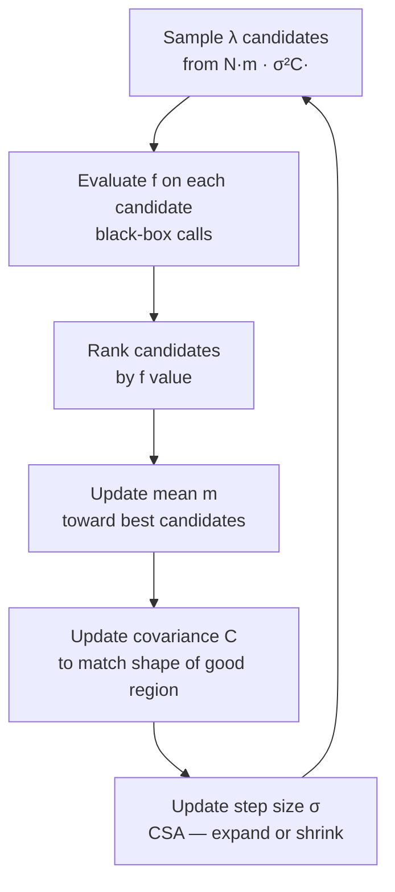
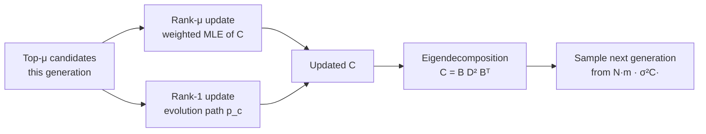
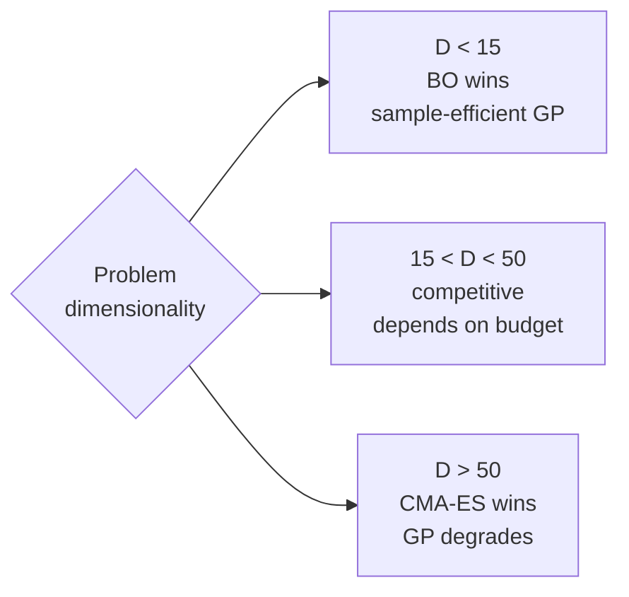

Explanation of the CMA-ES algorithm, why it is a black-box method, and how it applies to the ISP register optimization problem.

## What CMA-ES Is

[[cma-es]] (Covariance Matrix Adaptation Evolution Strategy) is a **gradient-free optimizer for continuous black-box problems**. It maintains a multivariate Gaussian distribution N(m, σ²C) over the search space and iteratively improves it based purely on function value rankings — no gradients, no surrogate model, no assumptions about the function required.

## The Core Loop

At each generation CMA-ES does three things:

Three parameters are adapted each generation:

| Parameter | Role | Adapts toward |
|---|---|---|
| **m** | Where to search | Mean of top-μ candidates |
| **C** | What shape to search in | Geometry of the high-performing region |
| **σ** | How far to search | Expands if progress, shrinks if stagnating |

## The Key Insight: C Approximates the Inverse Hessian

After sufficient adaptation, C approximates the **inverse Hessian** of the objective. CMA-ES implicitly learns second-order geometry without ever computing a derivative — it behaves like a second-order method in a gradient-free setting.

In practice: if two registers must move together to improve IQ metrics (correlated variables), CMA-ES discovers this and rotates its search distribution to align with that correlation.

## Why It Is a True Black-Box Method

CMA-ES makes no assumptions about the objective function:

- **No gradients** — only ranks of f-values are used, not magnitudes
- **No surrogate** — does not fit a model of the function
- **Rank-invariant** — any monotonic transformation of f-values (doubling all scores, log-scaling) produces identical behavior
- **Rotation-invariant** — learns the geometry of the search space from data
- **Scale-invariant** — step-size adaptation handles different parameter scales automatically

These invariances make it robust to the arbitrary scaling and correlations typical in ISP register spaces.

## Internal Update Mechanisms

- **Rank-μ update**: estimates covariance from top-μ candidates this generation
- **Rank-1 update (evolution path)**: cumulates the history of successful steps — captures long-range correlations across generations
- **CSA (cumulative step-size adaptation)**: adjusts σ based on evolution path length — expands when making consistent progress, shrinks when oscillating

## Default Parameters — Quasi-Parameter-Free

Population size λ ≈ 4 + 3·ln(n) candidates per generation (n = problem dimension):

| Dimension | λ (candidates/generation) |
|---|---|
| 20D | ~13 |
| 40D | ~16 |
| 200D | ~20 |

Default learning rates are derived theoretically and work robustly across problem classes without tuning. This is a major practical advantage over GA which requires careful mutation/crossover tuning.

## CMA-ES vs BO in Your Regime

From [[cma-es]]:

> On low-D problems (d < ~15), BO is typically more sample-efficient. Above ~20D, CMA-ES often competes or wins because GP degrades while CMA-ES's covariance adaptation remains effective.

Your problem is 200D (or 20–40D after reduction) with 300/min simulator throughput. This is exactly the regime where CMA-ES outperforms GP-based BO.

## How It Applies to the ISP Problem

The ISP problem: find ~200 register values that maximize IQ scores (MTF, false color, desaturation, ...) measured on a fixed test scene. The full evaluation = C++ ISP simulator (raw → RGB) + IQ measurement tool (RGB → scores), running at 300/min. XGBoost is the surrogate: trained on 300k (register, IQ scores) pairs, it predicts IQ scores from registers directly — skipping the expensive evaluation entirely.

| CMA-ES property | Why it matters for ISP registers |
|---|---|
| No gradients needed | XGBoost is not smoothly differentiable |
| Rank-based | XGBoost predictions need to be correctly ranked, not calibrated |
| Adapts to correlations | ISP block interactions create correlated register directions — unknown upfront, discovered by CMA-ES |
| Quasi-parameter-free | Default lambda approx 20 for 200D — no tuning needed |
| Multi-start | Run from N starting points, keep best — escapes local optima |

## Relevant Variants

| Variant | Complexity | When to use |
|---|---|---|
| **CMA-ES** [[hansen-cma-es-reference]] | O(n²) | Up to ~100D, standard choice |
| **LM-MA-ES** [[loshchilov-2017-lm-ma-es]] | O(n log n) | 200D+ — same quality, much cheaper |
| **LRA-CMA-ES** [[nomura-2024-lra-cma-es]] | O(n²) | Noisy or multimodal landscapes — auto-adapts learning rate |
| **BIPOP-CMA-ES** | O(n²) | Highly multimodal — restarts with increasing population |

For the ISP 200D problem: use **LM-MA-ES** if not reducing search space first; use standard **CMA-ES** after reducing to 20–40D active registers.

## See also

- [[cma-es]]
- [[hansen-cma-es-reference]]
- [[loshchilov-2017-lm-ma-es]]
- [[nomura-2024-lra-cma-es]]
- [[bayesian-optimization]]
- [[high-dimensional-bo]]
- [[isp-register-optimization]]
- [[Problem_Definition]]
