Detailed breakdown of every step inside the CMA-ES algorithm, one diagram per step.
See [[cma-es-explained]] for the high-level view and relationship to BBO.

---

## The Problem We Are Solving

### Context

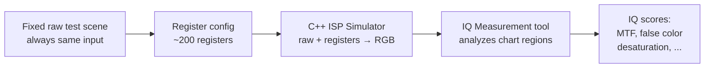

Two distinct steps per evaluation:
- **Simulator** — runs the ISP chain, outputs RGB of the test scene
- **IQ Measurement tool** — analyzes chart regions in the RGB, outputs one score per metric

Together they run at **300 configs/minute** via parallel CPUs. No real hardware involved.

### What Data We Have

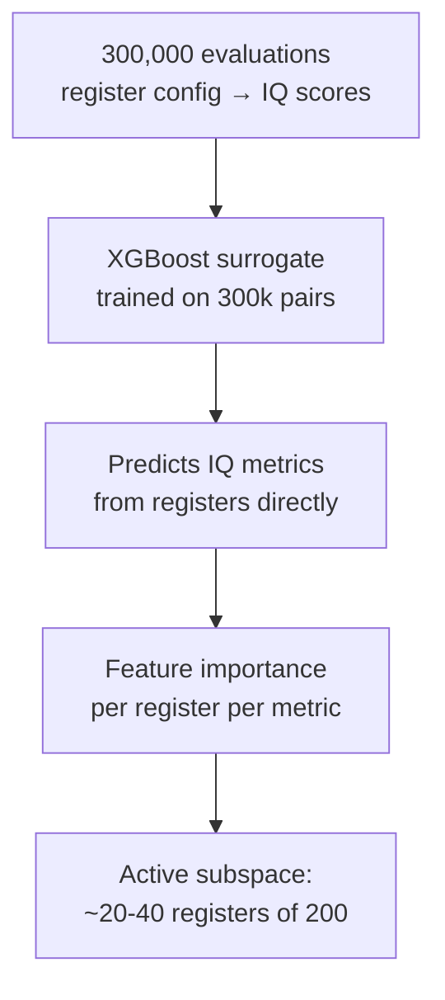

| Asset | Details |
|---|---|
| Training data | 300k (register config, IQ scores) pairs — ~16h of compute |
| Surrogate | XGBoost: registers → predicted IQ scores |
| C++ source | One file per ISP block — gives register → ISP block mapping only |
| Full evaluation | Simulator + IQ measurement, 300/min parallelized |
| Unknown | Which registers affect which metrics — found via XGBoost feature importance |

### The Goal


### Why CMA-ES and Not GA

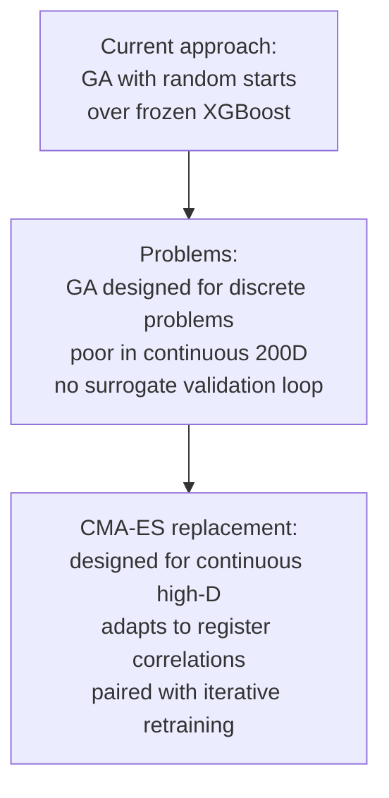

CMA-ES queries XGBoost millions of times for free (microsecond inference). After finding a promising region, the top configs are validated on the simulator and XGBoost is retrained on targeted samples if it disagrees. See [[isp-register-optimization]] for the full pipeline.

---

## The Three Things CMA-ES Maintains

Before the steps: CMA-ES tracks three quantities that fully define the search distribution at any point in time.

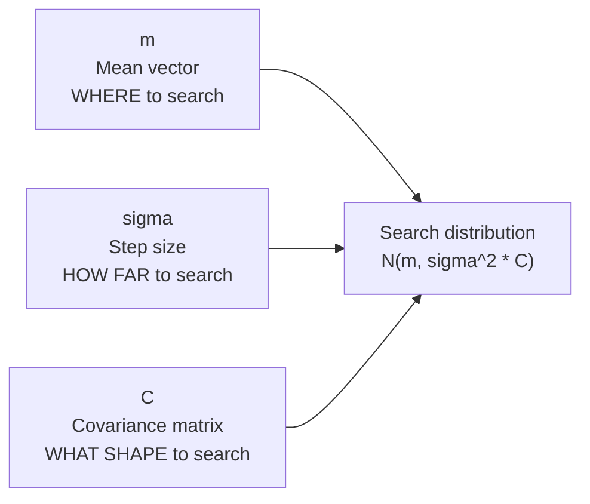

All three are adapted every generation based on the ranking of sampled candidates.

---

## Step 0 — Initialization

Set up all parameters before the first generation.

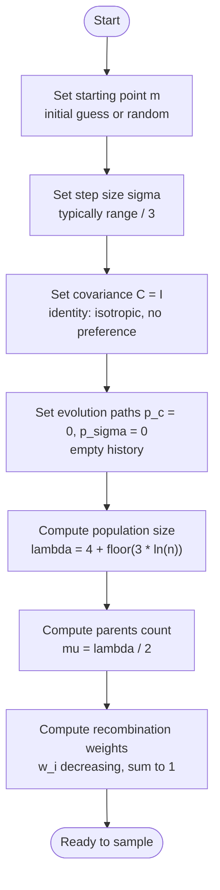

**Key defaults for your ISP problem (n = 40 active registers):**

| Parameter | Formula | Value (n=40) |
|---|---|---|
| λ (population) | 4 + floor(3·ln(n)) | ~15 candidates/generation |
| μ (parents) | λ / 2 | ~7 selected |
| σ (step size) | register range / 3 | set per register |
| C | Identity matrix | isotropic start |

---

## Step 1 — Sampling

Draw λ candidate solutions from the current search distribution.

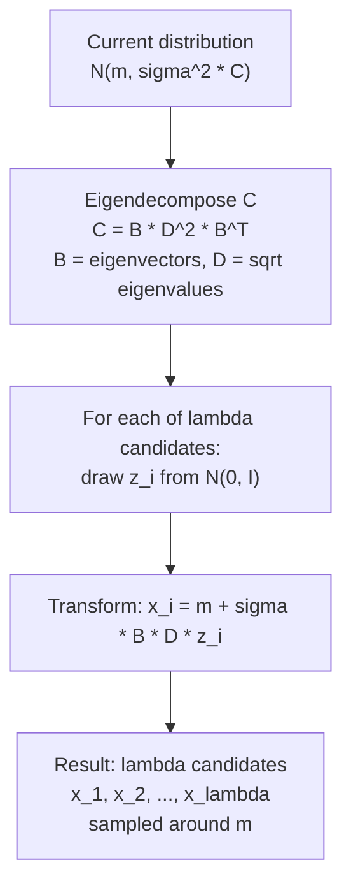

**Intuition:** B rotates the sample to align with C's eigenvectors. D scales each axis by the corresponding eigenvalue. This means the cloud of candidates has the same shape as C — ellipsoidal, aligned with the landscape.

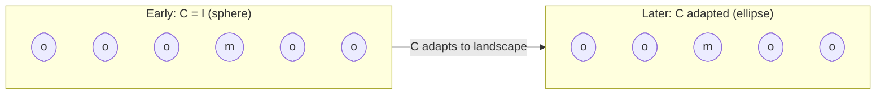

---

## Step 2 — Evaluation and Ranking

Evaluate the true (black-box) function on each candidate and rank them.

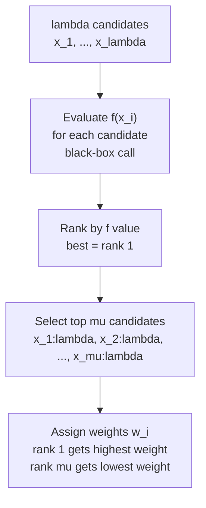

**Only ranks matter — not magnitudes.** Whether the best candidate scores 0.1 or 1000 is irrelevant. Only that it ranked first. This makes CMA-ES invariant to any monotonic transformation of f — including your XGBoost predictions, which only need to rank correctly, not be calibrated.

---

## Step 3 — Mean Update (Recombination)

Move the search center toward the weighted centroid of the top-μ candidates.

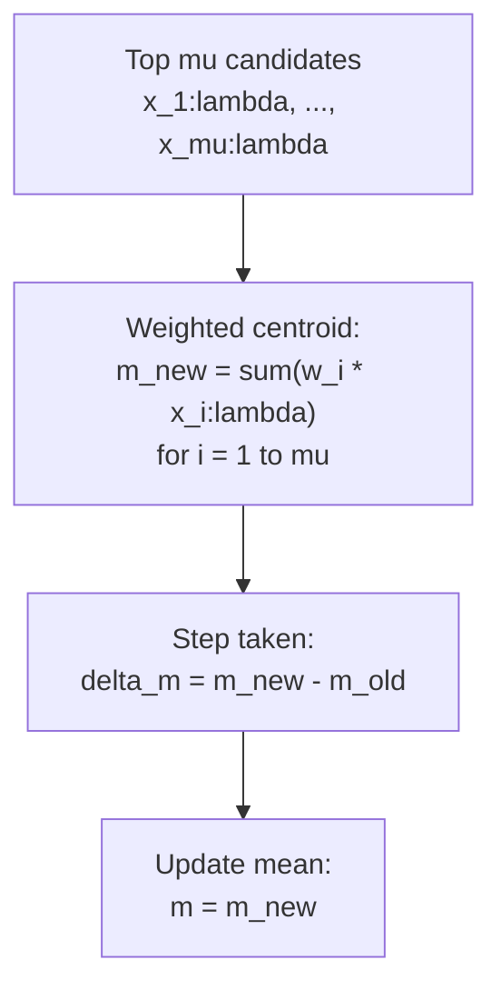

**Intuition:** the mean shifts toward the best candidates. The weight w_1 > w_2 > ... > w_μ means the best candidate pulls harder than the second-best, and so on. This is a weighted gradient step without computing any gradient.

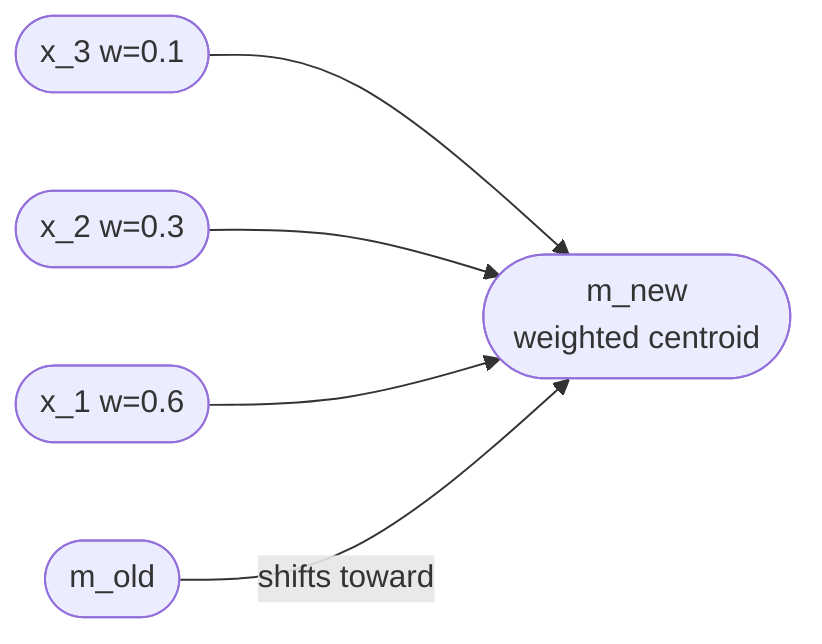

---

## Step 4 — Evolution Path Update

Two evolution paths are maintained: **p_c** (for covariance update) and **p_sigma** (for step size control). Both accumulate the history of mean shifts.

### 4a — Step Size Evolution Path (p_sigma)

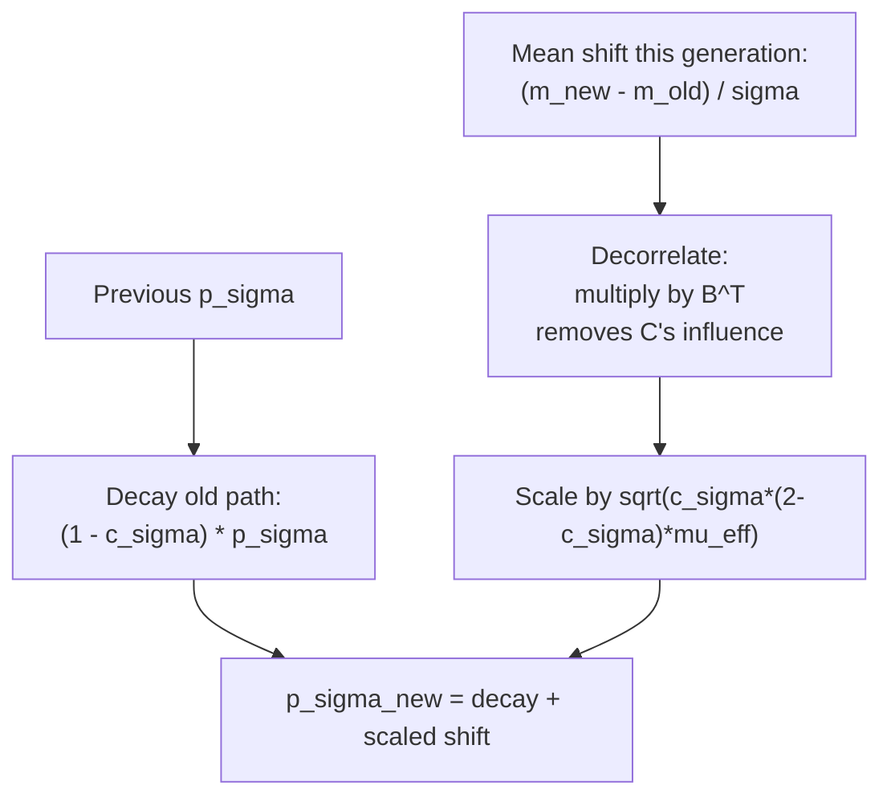

p_sigma lives in the isotropic space (after removing C's rotation). It measures how consistently the mean is moving — if it moves in the same direction repeatedly, p_sigma grows long.

### 4b — Covariance Evolution Path (p_c)

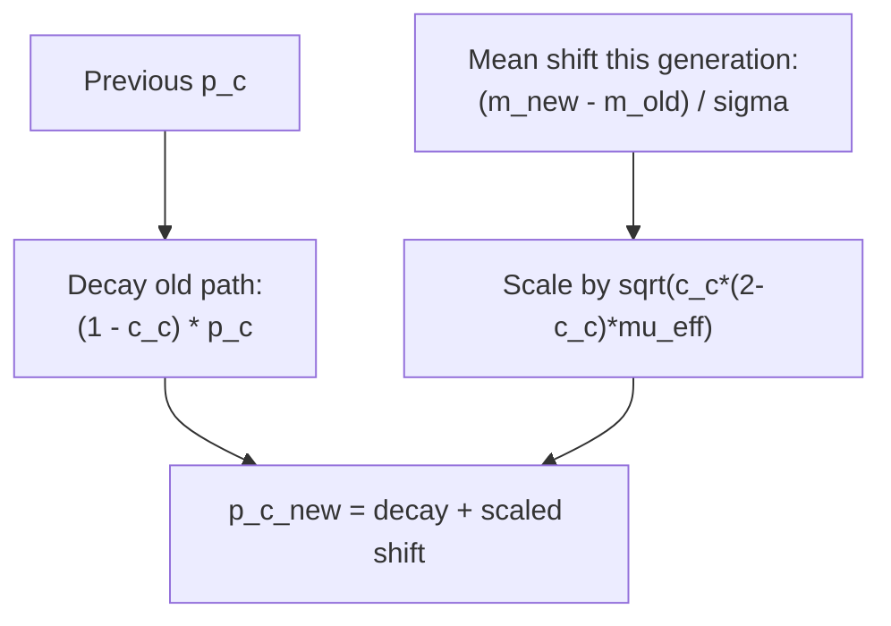

p_c accumulates the raw mean shifts (not decorrelated). It captures the direction in which the search is progressing — used to update C.

---

## Step 5 — Step Size Adaptation (CSA)

Adjust σ based on the length of p_sigma compared to what a random walk would produce.

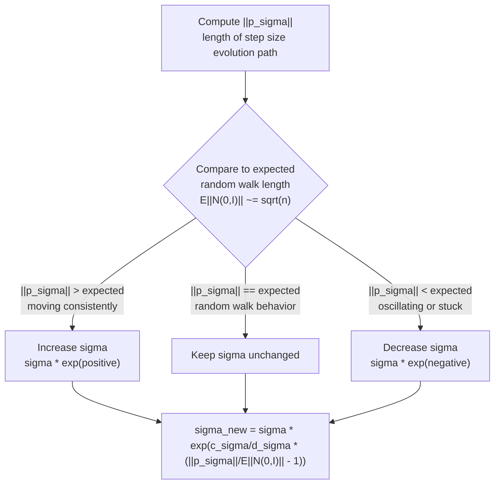

**Intuition — why this works:**
- If the mean moves in the same direction many generations in a row, p_sigma accumulates and grows long → increase σ to take bigger steps
- If the mean oscillates back and forth, p_sigma stays short → decrease σ to avoid overshooting
- Targets the random walk length as the "neutral" reference

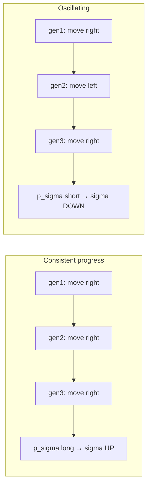

---

## Step 6 — Covariance Matrix Update

Update C to reflect the shape of the high-performing region. Two complementary updates are combined.

### 6a — Rank-1 Update (from evolution path)

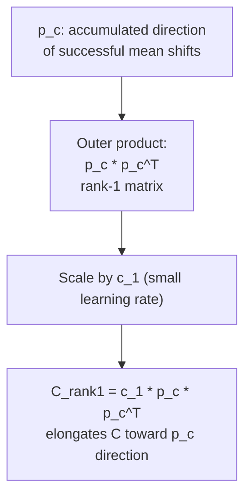

The rank-1 update uses the long-term direction of search progress. If the mean has been consistently moving toward (register_A high, register_B low), p_c points that way and C gets elongated in that direction.

### 6b — Rank-mu Update (from current generation)

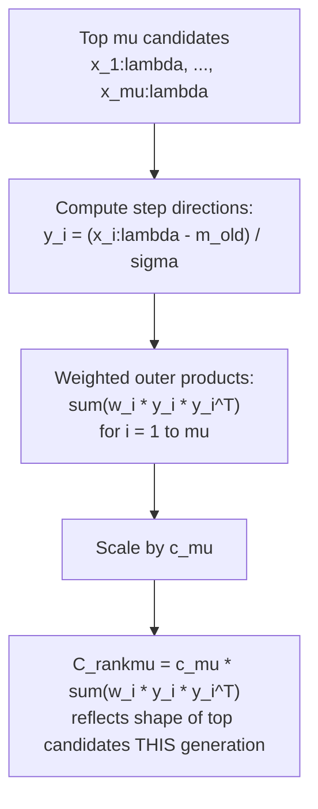

The rank-μ update learns from where the best candidates were in the current generation — a fast, short-term signal.

### 6c — Full Covariance Update

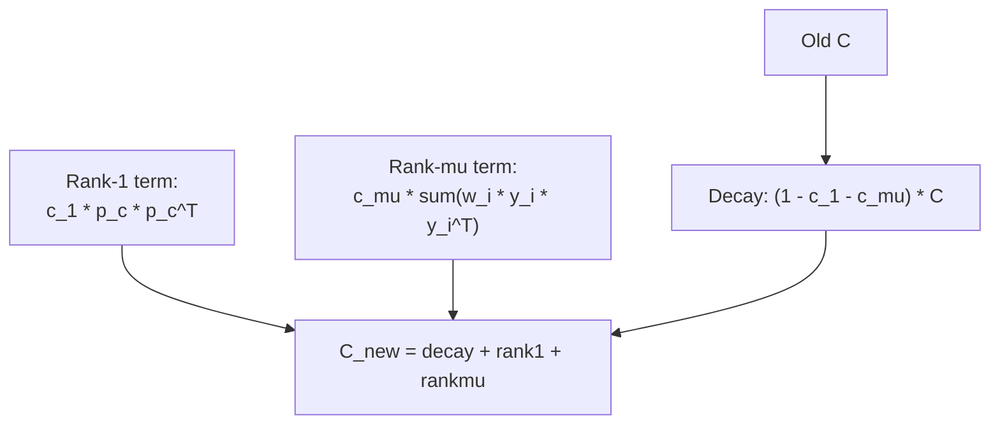

**Why both updates?**
- Rank-1 uses cumulated history → good for long-range correlation, slow to adapt
- Rank-μ uses current generation → fast response, but noisier
- Together they balance stability and responsiveness

---

## Step 7 — Termination Check

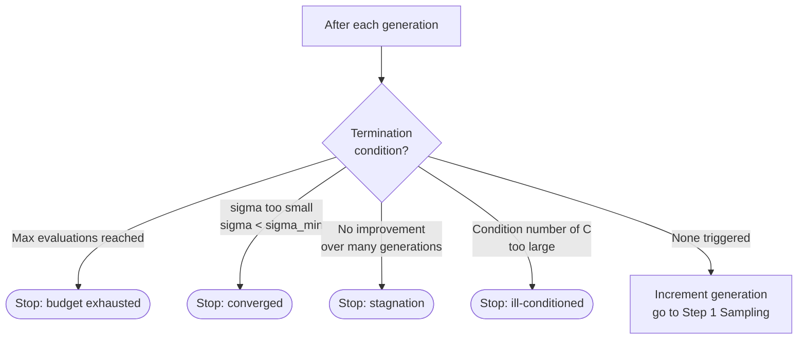

For your ISP problem: set max evaluations based on your XGBoost query budget (millions are free), not simulator budget.

---

## Complete CMA-ES Loop

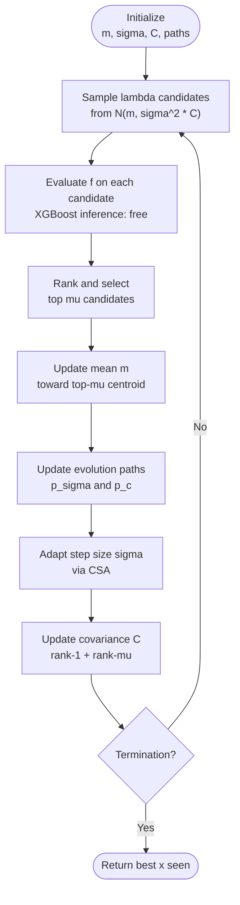

---

## What C Learns Over Time

The covariance matrix C is the most powerful part of CMA-ES. It learns the geometry of the objective function's level sets.

```mermaid
flowchart TD
    subgraph Gen1 ["Generation 1-10: C = I (sphere)"]
        A1["Candidates spread<br/>equally in all directions"]
    end
    subgraph Gen2 ["Generation 10-50: C adapting"]
        A2["Candidates elongating<br/>toward promising directions"]
    end
    subgraph Gen3 ["Generation 50+: C converged"]
        A3["Candidates aligned with<br/>objective level sets<br/>efficient search ellipse"]
    end
    Gen1 --> Gen2 --> Gen3
```

**For ISP registers:** if registers R12 and R45 must increase together to improve sharpness (correlated), C learns this correlation and samples candidates that move both registers simultaneously. GA would have to stumble onto this by chance. CMA-ES discovers it systematically.

---

## Why It Works for Black-Box Problems

```mermaid
flowchart LR
    A["Black-box function f<br/>no gradient available"] --> B["CMA-ES uses only<br/>rank of f(x_i)"]
    B --> C["Rank-invariant:<br/>f or log(f) or f^2<br/>gives identical result"]
    C --> D["Learns geometry<br/>from ranking patterns<br/>across generations"]
    D --> E["Approximates inverse Hessian<br/>in C without any derivative"]
```

---

## Variants — When to Use Which

```mermaid
flowchart TD
    A{"Problem<br/>dimensionality"} --> B["n < 100<br/>Standard CMA-ES<br/>O(n^2), reference impl"]
    A --> C["n = 100 to 1000<br/>LM-MA-ES<br/>O(n log n)"]
    A --> D["n > 1000<br/>Diagonal CMA-ES<br/>O(n), loses rotation invariance"]
    E{"Landscape<br/>type"} --> F["Noisy or multimodal<br/>LRA-CMA-ES<br/>auto-adapts learning rate"]
    E --> G["Many local optima<br/>BIPOP-CMA-ES<br/>restarts with growing population"]
```

For your ISP problem: **standard CMA-ES** on 20–40D reduced space, or **LM-MA-ES** if running on full 200D.

---

## See also

- [[cma-es]]
- [[cma-es-explained]]
- [[hansen-cma-es-reference]]
- [[loshchilov-2017-lm-ma-es]]
- [[nomura-2024-lra-cma-es]]
- [[isp-register-optimization]]
- [[bayesian-optimization]]
