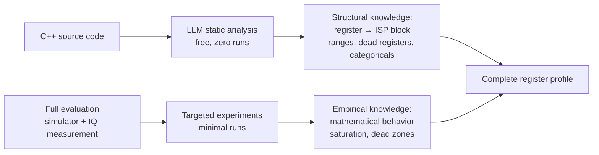
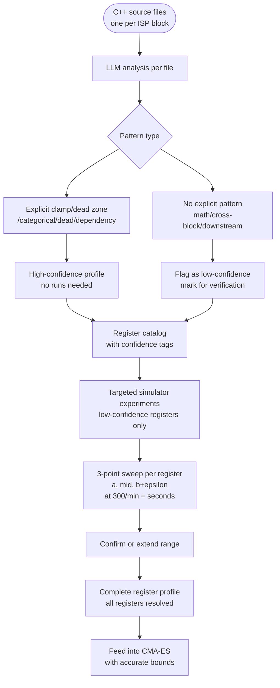
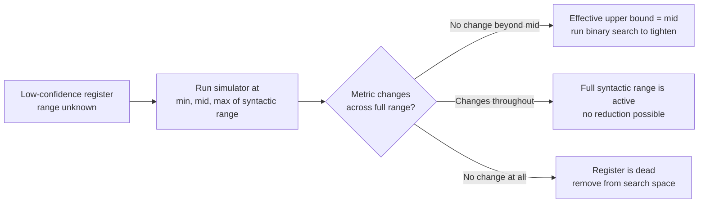
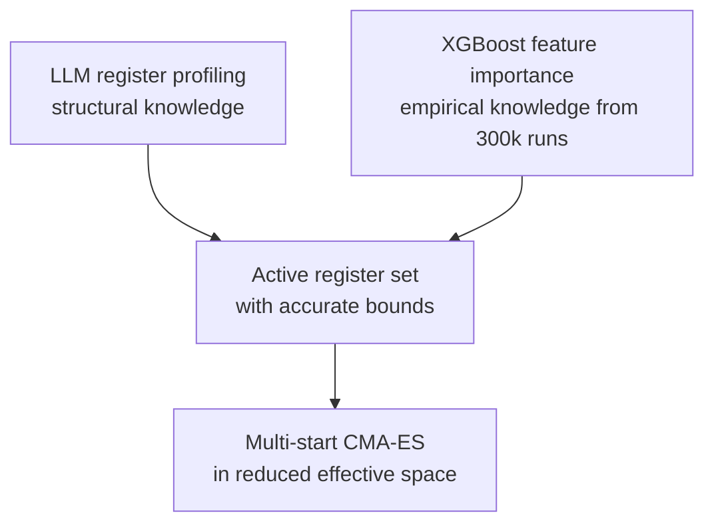

Workflow for using LLM analysis of C++ ISP block source files to extract structured register profiles — with an honest split between what can be determined from code alone vs what requires simulator runs.

---

## What the C++ Code Tells Us (and What It Does Not)

The C++ source gives us the **register → ISP block** mapping — which registers each block reads. It does **not** tell us which registers affect which IQ metrics. That relationship runs through the full pipeline:


The gap between C and D — how an image change translates to a specific metric score — requires running the IQ measurement tool on real RGB outputs. Only XGBoost feature importance on the 300k training pairs reveals this empirically.

## Two-Source Register Profiling

Register structural knowledge comes from two complementary sources:



---

## What LLM Can Find Reliably (Zero Runs)

LLM analysis is reliable only for **explicit patterns** directly visible in code:

### 1. Effective range from explicit clamp/min/max

```cpp
uint8_t strength = std::clamp(register_x, 0, 100);
// → effective range [0, 100] — certain
```

```cpp
float value = std::min(register_x, 255.0f);
// → upper bound 255 — certain
```

### 2. Explicit dead zones

```cpp
if (register_x < 5) register_x = 0;
// → [0, 5] all map to same output — dead zone confirmed
```

### 3. Categorical registers

```cpp
switch(register_x) { case 0: ... case 1: ... case 2: ... }
// → only {0, 1, 2} matter — treat as discrete
```

### 4. Dead registers

```cpp
int legacy_mode = register_x;
// legacy_mode never referenced downstream
// → remove from search space entirely
```

### 5. Conditional dependencies

```cpp
if (denoise_enabled) { apply(denoise_strength); }
// → denoise_strength irrelevant when denoise_enabled == 0
```

### 6. Threshold breakpoints

```cpp
if (register_x > 128) { apply_strong_filter(); }
else                  { apply_weak_filter(); }
// → 128 is a behavioral boundary — include in initial samples
```

---

## What LLM Cannot Find (Requires Simulator)

These patterns cannot be resolved by reading code alone:

### 1. Mathematical saturation — no explicit clamp

```cpp
output = sigmoid(register_x * weight + bias);
// → where does this saturate? Depends on weight, bias, downstream usage
// → LLM cannot determine effective range
```

### 2. Quantization dead zones — step size computed elsewhere

```cpp
int level = (int)(register_x / step_size);
// → if step_size is loaded from config at runtime, LLM cannot resolve it
```

### 3. Downstream clamping — effect visible only later in pipeline

```cpp
float raw = compute(register_x);
// → raw gets clamped in a later block — LLM analyzing this file alone misses it
```

### 4. Cross-block interactions

```cpp
// register_x written in block A, effective range constrained by block B
// → requires tracing across multiple files
```

---

## Honest Capability Table

| What to find | LLM alone | Simulator needed | Confidence |
|---|---|---|---|
| Explicit clamp bounds | Yes | No | High |
| Explicit dead zones `if x<5: x=0` | Yes | No | High |
| Categorical registers | Yes | No | High |
| Dead registers | Yes | No | High |
| Conditional dependencies | Yes | No | High |
| Threshold breakpoints | Yes | No | High |
| Mathematical saturation | No | Yes | Low until verified |
| Quantization step size | No | Yes | Low until verified |
| Cross-block constraints | No | Yes | Low until verified |
| Downstream clamping | No | Yes | Low until verified |

---

## Full Workflow



---

## LLM Prompt Per ISP Block File

```
You are analyzing a C++ ISP block implementation.
For every register variable in this file, extract ONLY what is
explicitly visible in the code. Do not infer or guess behavior
that requires running the code.

For each register report:
1. Name and declared type
2. Syntactic range (from type)
3. Effective range IF there is an explicit clamp/min/max/assert
4. Dead zone IF there is an explicit conditional assignment (if x<a: x=b)
5. Whether it is categorical (switch or if-else on specific integer values)
6. Whether it is dead (result never used downstream in this file)
7. Conditional dependency (gated by another register)
8. Threshold breakpoints (if-else boundaries)
9. Confidence: HIGH if pattern is explicit, LOW if behavior requires runtime

Flag anything involving math without explicit bounds as LOW confidence.
Flag anything that depends on values from other files as LOW confidence.

Output a structured table. One row per register.
```

---

## Targeted Simulator Verification (Low-Confidence Registers)

For each low-confidence register, run a 3-point sweep:



At 300 runs/minute, verifying 50 low-confidence registers takes under 1 minute.

---

## Register Profile Output Format

One table per ISP block:

| Register | Type | Syntactic range | Effective range | Dead zone | Thresholds | Kind | Dependency | Confidence |
|---|---|---|---|---|---|---|---|---|
| `sharpness_strength` | uint8 | [0, 255] | [0, 100] | none | none | continuous | none | High — explicit clamp |
| `noise_threshold` | float | [0, ∞) | unknown | unknown | none | continuous | none | Low — math saturation |
| `gain_mode` | int | [0, 3] | — | — | — | categorical {0,1,2,3} | none | High — explicit switch |
| `denoise_strength` | uint8 | [0, 255] | unknown | none | none | continuous | `denoise_enabled==1` | Low — downstream clamp |
| `legacy_flag` | int | [0, 1] | — | — | — | dead | — | High — result unused |

---

## Integration with Optimization Pipeline



LLM profiling and XGBoost importance are complementary:
- **LLM profiling**: what the code says registers can do (structure)
- **XGBoost importance**: what the data shows registers actually do (empirics)

A register removed by both sources is confidently dead.
A register flagged by one but not the other warrants investigation.

---

## Limitations

- LLM may miss indirect register access through pointers or function calls across files
- Complex numerical behavior requires runtime verification
- Very long files should be split by function before LLM analysis
- Cross-block register interactions require analyzing the full call chain

---

## See also

- [[Problem_Definition]]
- [[isp-register-optimization]]
- [[cma-es]]
- [[high-dimensional-bo]]
- [[surrogate-model]]
