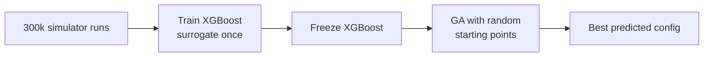
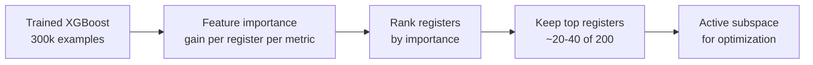
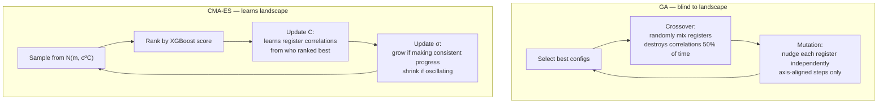
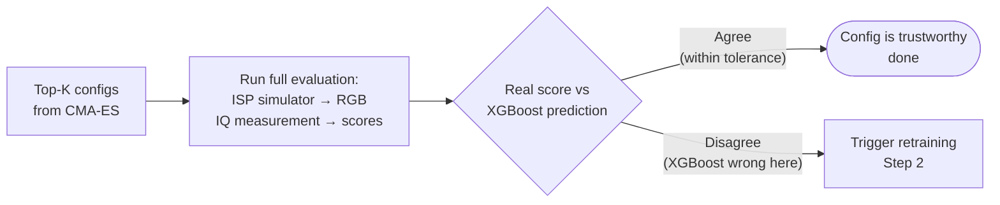
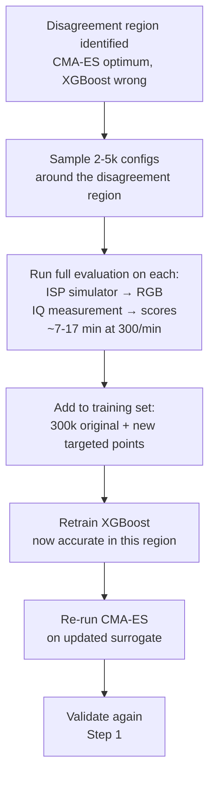
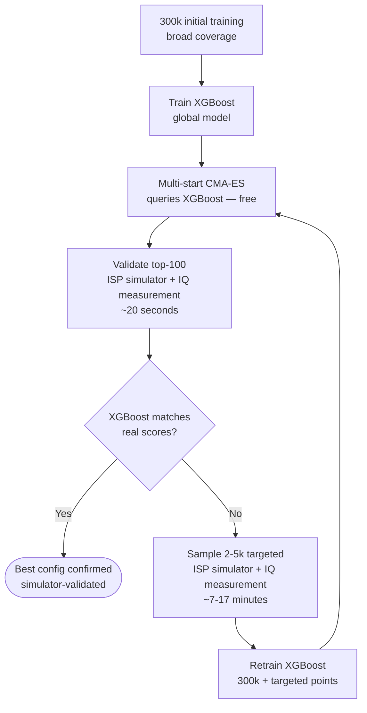
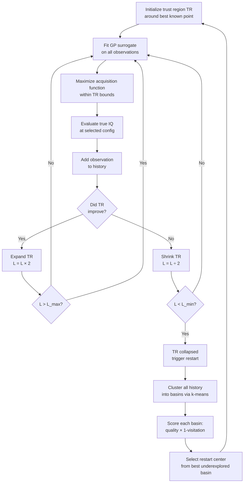

Recommendation for optimizing ~200 ISP registers across multiple ISP blocks to maximize image quality metrics. Everything runs on the simulator — no real hardware involved.

## Problem Structure

- **Search space:** ~200 continuous registers across multiple ISP blocks
- **Objective:** maximize weighted combination of image quality metrics (MTF, false color, desaturation, ...)
- **Pipeline:** Fixed raw test scene + registers → C++ ISP Simulator → RGB → IQ Measurement tool → IQ scores
- **Two-step evaluation:** simulator (raw → RGB) + IQ measurement tool (RGB → scores) — both run together at 300/min
- **Raw input is fixed:** always the same test scene; only the register config varies
- **Register → metric mapping unknown:** which registers affect which metrics is discovered empirically, not known upfront
- **Training data:** 300,000 (register config, IQ metrics) pairs, ~16h of compute
- **Current surrogate:** XGBoost trained once — predicts IQ metrics from registers
- **Current optimizer:** genetic algorithm with random starting points over frozen XGBoost

## Current Approach



## Weak Points

1. **GA in continuous 200D** — GA is designed for discrete/combinatorial problems. In continuous high-D space it converges poorly and gets stuck in local optima.
2. **Random starting points** — spread poorly in 200D; many starts explore redundant regions.
3. **Frozen surrogate, no validation loop** — XGBoost is never checked against the simulator after training. GA may find a region where XGBoost is wrong, and the final config is never validated.
4. **Full 200D search** — most registers have minimal effect on most metrics. Searching all 200 simultaneously dilutes optimization budget.

## Sensitivity Analysis: XGBoost Feature Importance

No additional simulator runs needed. XGBoost computes per-register importance natively from the existing trained model.



Use **gain** importance (contribution to metric improvement at each split) rather than frequency. Run separately per metric to understand which registers drive which IQ dimensions.

Cross-reference with C++ static analysis: registers read by ISP blocks with no path to target metrics can be eliminated before even running XGBoost importance.

## Recommended Approach: Multi-Start CMA-ES + Iterative Refinement

Replace GA with **[[cma-es]]** (CMA-ES). CMA-ES is specifically designed for continuous high-D optimization — it adapts its search covariance matrix to the landscape geometry as it explores.


## CMA-ES vs GA

### Why GA Fails on Continuous Landscapes

GA has three operations: selection (keep the best), crossover (mix two parents), mutation (random nudge). None of these learn the landscape.

**Problem 1 — Crossover destroys register correlations**

Suppose registers R12 and R45 must both increase together to improve sharpness. In the population:

```
Parent A: R12=200, R45=10   ← good R12, bad R45
Parent B: R12=50,  R45=180  ← bad R12, good R45
```

Crossover produces either the useful combination (R12=200, R45=180) or the worst of both (R12=50, R45=10) — 50/50. GA has no idea R12 and R45 are correlated. It destroys correlations as often as it creates them.

**Problem 2 — Mutation steps are axis-aligned**

If the optimum lies diagonally (R12 and R45 must increase together), mutation nudges each register independently. Steps are always horizontal or vertical — never diagonal. Most steps move perpendicular to the useful direction, wasting evaluation budget.

**Problem 3 — No cross-generation memory**

GA has no record of which direction has been working. Generation N has no memory of the trajectory from generations N-3 through N-1.

---

### How CMA-ES Adapts to the Landscape

CMA-ES learns from the rankings it observes and encodes that knowledge in three structures that persist and accumulate across generations.

**1. Covariance matrix C — learns which registers must move together**

C starts as a sphere (equal sampling in all directions). After a few generations where high-R12 + high-R45 consistently ranks best, C develops a positive correlation between those two dimensions. Future samples are drawn along the diagonal — aligned with the actual landscape geometry. GA would have to stumble onto this correlation by chance; CMA-ES discovers it systematically.

**2. Evolution paths p_c — remembers which direction was working**

p_c accumulates the history of mean shifts across generations. If the mean moved (+R12, +R45) in generations 1, 2, and 3, p_c grows long in that direction. C gets elongated there. The search doubles down on what has been working rather than starting fresh each generation.

**3. Step size σ — adapts to progress**

If the mean moves consistently in one direction, p_sigma grows → σ increases → take bigger steps (on a slope, keep going fast). If the mean oscillates, p_sigma stays short → σ shrinks → be precise (near the optimum). GA mutation magnitude follows a fixed schedule with no response to what the landscape is signaling.

---

### Side-by-Side Loop



### Comparison Table

| | GA | CMA-ES |
|---|---|---|
| Designed for | Discrete / combinatorial | Continuous high-D |
| Learns register correlations | No — crossover breaks them randomly | Yes — C encodes them explicitly |
| Cross-generation memory | No | Yes — evolution paths p_c, p_sigma |
| Adapts step size | No — fixed schedule | Yes — CSA responds to progress |
| Handles diagonal landscapes | Poorly — axis-aligned steps | Well — rotates sampling ellipse |
| XGBoost queries | Limited by population size | Millions, free |
| Local optima | Gets stuck | Multi-start escapes |

For large-scale continuous problems, use **[[loshchilov-2017-lm-ma-es]]** (LM-MA-ES) which runs in O(n log n) — better suited if operating on the full 200D space.

## Why Train-Once Is Insufficient

Training XGBoost once on 300k broadly-sampled points gives good global coverage but poor local accuracy. CMA-ES converges to a narrow high-performance region of the 200D space. That region is almost certainly underrepresented in the original 300k — which were collected to cover the space broadly, not to be dense around the optimum.

This is documented in [[koratikere-2025-snbo]] as a known limitation of train-once surrogates. [[bartz-beielstein-2016-surrogate-bbo]] establishes iterative surrogate updating (infill strategy) as standard practice in surrogate-based BBO.

**The failure mode:** XGBoost predicts config X is optimal → GA/CMA-ES selects it → simulator disagrees → you took the wrong config with no way to know.

## Iterative Surrogate Retraining Loop

Two distinct steps — validation always runs; retraining only runs when validation fails.

### Step 1 — Validation (always, cheap)

Take the top-K configs CMA-ES found and run the full evaluation on them: ISP simulator (raw → RGB) + IQ measurement tool (RGB → scores). Compare the real scores against XGBoost's predictions.



Cost: ~100 configs × (1/300 min) ≈ **20 seconds**. Always worth doing — it is your only guard against deploying a config that XGBoost hallucinated as optimal.

### Step 2 — Targeted Retraining (only on disagreement)

When XGBoost and the real evaluation disagree, XGBoost is inaccurate in the region CMA-ES converged to. The fix: sample more configs densely in that region, run the full evaluation on all of them (yes — ISP chain + IQ measurement), and add those results to XGBoost's training data.



**Why 2–5k samples, not just the top-K?** The top-100 validation configs are too few to characterize a region in 20–40D space. XGBoost needs density — ~2–5k points to fit the local surface accurately.

**Why targeted, not random?** Your original 300k covered all 200D broadly. New random samples would again be sparse in the high-performance region. Targeted samples are concentrated exactly where CMA-ES converged — the only place accuracy matters now.

### Full Loop



**Expected cost:** 2–4 retraining rounds × ~17 min each = under 1 hour total. The 300k baseline stays — only small targeted batches are added per round.

## MG-TuRBO Internal Flow (Reference)

Included for reference — MG-TuRBO is not the recommended method here (wrong regime for 300/min throughput), but documents the trust-region approach considered earlier.



## Summary of Changes from Current Approach

| Aspect | Current | Recommended |
|---|---|---|
| Sensitivity analysis | None | XGBoost feature importance (free) |
| Search space | 200D | 20-40D active registers |
| Optimizer | GA, random starts | Multi-start CMA-ES |
| Surrogate training | Once, frozen forever | Iterative: broad init + targeted refinement |
| Surrogate updates | Never | 2-5k targeted points per round, ~17 min |
| Simulator use | Training data only | Validation + targeted retraining |
| Final output | XGBoost-predicted best | Simulator-validated best |

## Why LLM-BO Hybrids Are Not the Right Fit

LLM-BO hybrids are designed for expensive evaluation regimes with very limited data. With 300/min simulator throughput and 300k training examples, this problem is in a different regime entirely — a trained XGBoost surrogate handles the register → metric mapping far better than an LLM.

## See also

- [[Problem_Definition]]
- [[cma-es]]
- [[loshchilov-2017-lm-ma-es]]
- [[high-dimensional-bo]]
- [[surrogate-model]]
- [[koratikere-2025-snbo]]
- [[bayesian-optimization]]
- [[gonzalez-2024-hdbo-survey]]
