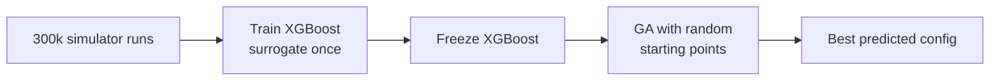
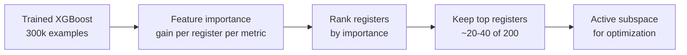
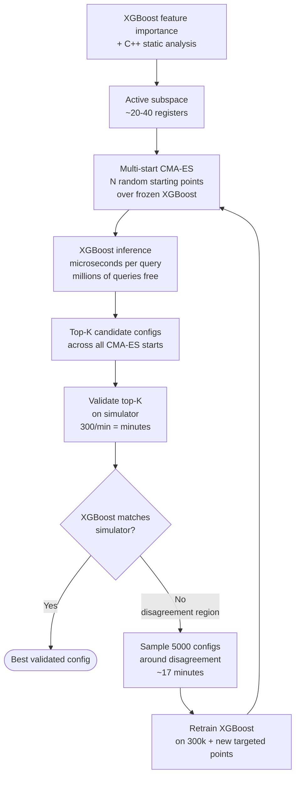
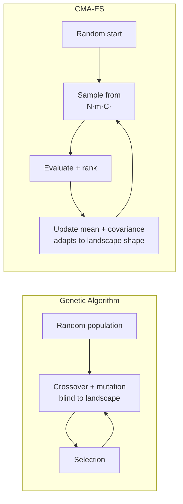
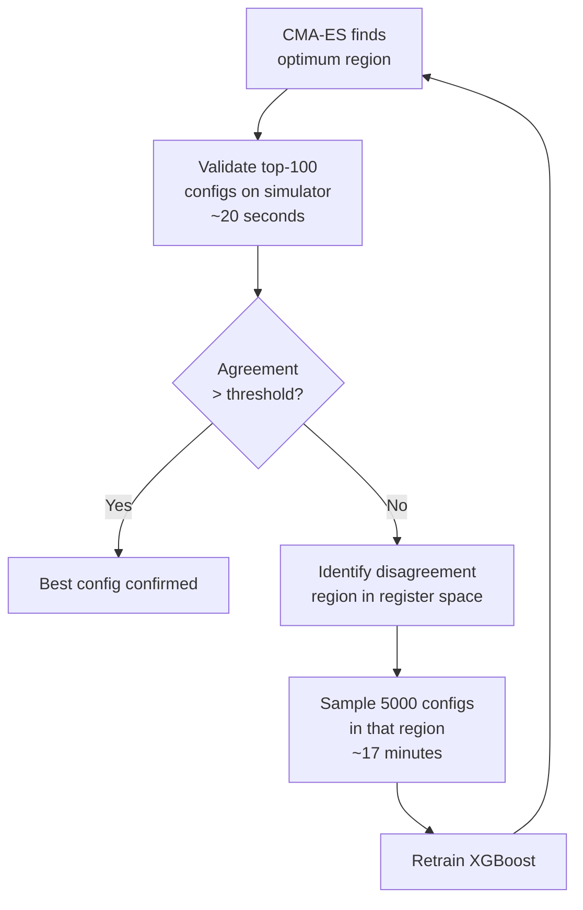
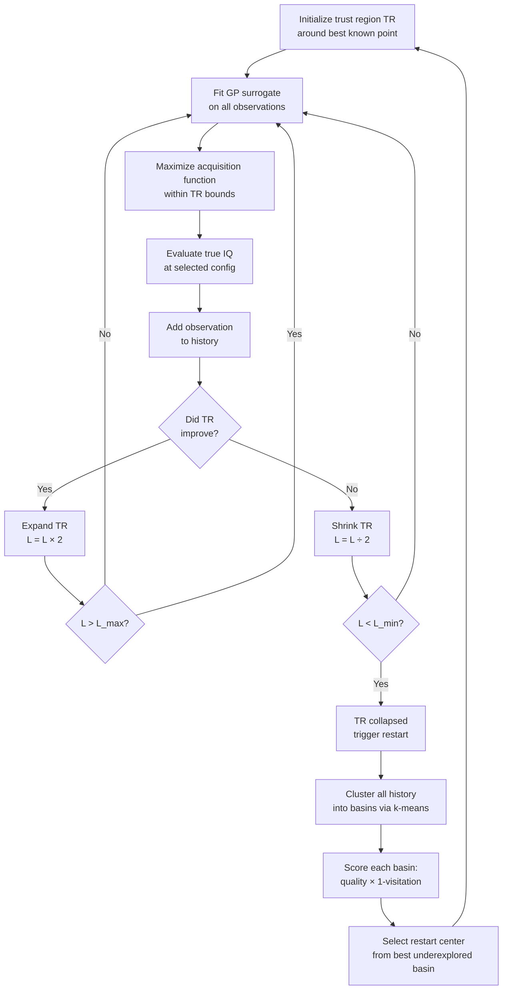

Recommendation for optimizing ~200 ISP registers across multiple ISP blocks to maximize image quality metrics. Everything runs on the simulator — no real hardware involved.

## Problem Structure

- **Search space:** ~200 continuous registers across multiple ISP blocks
- **Objective:** maximize weighted combination of image quality metrics
- **Pipeline:** Registers → C++ ISP simulator → RGB image → IQ metrics
- **Simulator throughput:** 300 runs/minute via parallel CPUs — the ground truth oracle
- **Training data:** 300,000 simulator runs (registers + IQ metrics), collected in ~16h
- **Current surrogate:** XGBoost trained once on 300k examples, frozen
- **Current optimizer:** genetic algorithm with random starting points over frozen XGBoost

## Current Approach

## Weak Points

1. **GA in continuous 200D** — GA is designed for discrete/combinatorial problems. In continuous high-D space it converges poorly and gets stuck in local optima.
2. **Random starting points** — spread poorly in 200D; many starts explore redundant regions.
3. **Frozen surrogate, no validation loop** — XGBoost is never checked against the simulator after training. GA may find a region where XGBoost is wrong, and the final config is never validated.
4. **Full 200D search** — most registers have minimal effect on most metrics. Searching all 200 simultaneously dilutes optimization budget.

## Sensitivity Analysis: XGBoost Feature Importance

No additional simulator runs needed. XGBoost computes per-register importance natively from the existing trained model.

Use **gain** importance (contribution to metric improvement at each split) rather than frequency. Run separately per metric to understand which registers drive which IQ dimensions.

Cross-reference with C++ static analysis: registers read by ISP blocks with no path to target metrics can be eliminated before even running XGBoost importance.

## Recommended Approach: Multi-Start CMA-ES + Iterative Refinement

Replace GA with **[[cma-es]]** (CMA-ES). CMA-ES is specifically designed for continuous high-D optimization — it adapts its search covariance matrix to the landscape geometry as it explores.

## CMA-ES vs GA

| | GA | CMA-ES |
|---|---|---|
| Designed for | Discrete / combinatorial | Continuous high-D |
| Adapts to landscape | No | Yes — covariance matrix |
| Starting points | Random, unstructured | Structured multi-start |
| XGBoost queries | Limited by population size | Millions, free |
| Local optima | Gets stuck | Multi-start escapes |

For large-scale continuous problems, use **[[loshchilov-2017-lm-ma-es]]** (LM-MA-ES) which runs in O(n log n) — better suited if operating on the full 200D space.

## Iterative Refinement Loop

The simulator at 300/min makes the validation loop nearly free:

Each iteration costs minutes. Run until XGBoost reliably matches the simulator in the high-performance region.

## MG-TuRBO Internal Flow (Reference)

Included for reference — MG-TuRBO is not the recommended method here (wrong regime for 300/min throughput), but documents the trust-region approach considered earlier.

## Summary of Changes from Current Approach

| Aspect | Current | Recommended |
|---|---|---|
| Sensitivity analysis | None | XGBoost feature importance (free) |
| Search space | 200D | 20-40D active registers |
| Optimizer | GA, random starts | Multi-start CMA-ES |
| Surrogate updates | Never | Iterative on simulator disagreement |
| Simulator use | Training data only | Fast validation + targeted retraining |
| Final output | XGBoost-predicted best | Simulator-validated best |

## Why LLM-BO Hybrids Are Not the Right Fit

LLM-BO hybrids are designed for expensive evaluation regimes with very limited data. With 300/min simulator throughput and 300k training examples, this problem is in a different regime entirely — a trained XGBoost surrogate handles the register → metric mapping far better than an LLM.

## See also

- [[Problem_Definition]]
- [[cma-es]]
- [[loshchilov-2017-lm-ma-es]]
- [[high-dimensional-bo]]
- [[surrogate-model]]
- [[koratikere-2025-snbo]]
- [[bayesian-optimization]]
- [[gonzalez-2024-hdbo-survey]]
