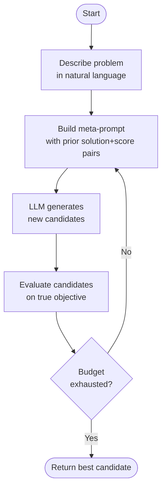
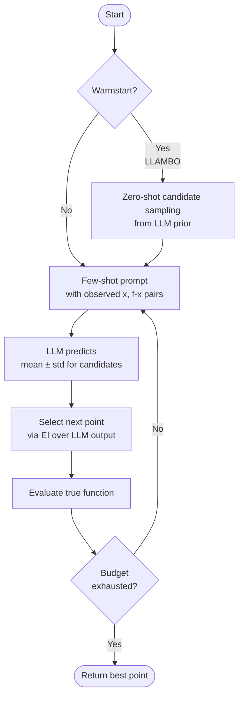
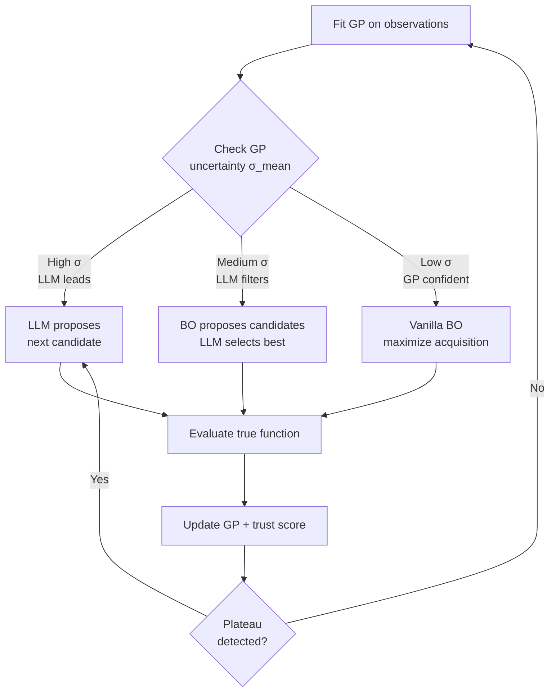
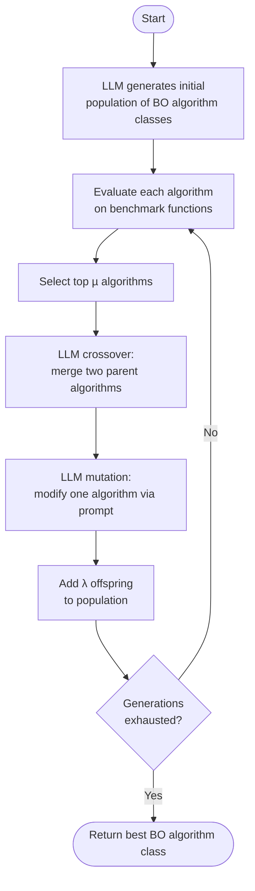
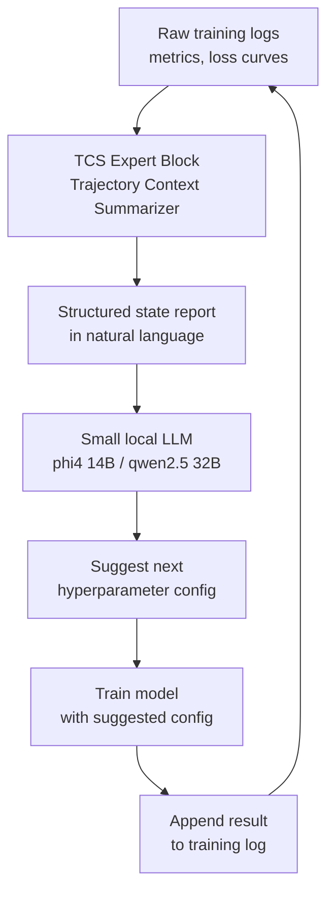

Synthesis of how LLMs are integrated into [[bayesian-optimization]] loops and what improvements each pattern delivers.

## Pattern 1 — LLM as Optimizer

**Paper:** [[yang-2023-opro]] (Google DeepMind, 2023)

LLM receives a meta-prompt containing prior `(solution, score)` pairs and generates new candidates directly. No [[gaussian-process]] involved. Applied to prompt optimization, linear regression, and TSP.

**Improvement:** +8% on GSM8K, +50% on BBH prompt optimization tasks.

---

## Pattern 2 — LLM as Surrogate

**Papers:** [[liu-2024-llambo]] (ICLR 2024), [[meindl-2025-gptopt]]

LLM predicts `f(x)` from few-shot examples in natural language, replacing the GP [[surrogate-model]]. LLAMBO also performs zero-shot warmstarting, eliminating the cold-start problem. GPTOpt fine-tunes Llama 3.1 8B on 2M BO trajectories to produce `mean ± std` estimates and select via EI.

**Improvement:** strongest in the **early/data-scarce regime** where a GP has too few observations to fit reliably.

---

## Pattern 3 — Adaptive Switching

**Papers:** [[huo-2025-bora]] (IJCAI 2025), [[chang-2025-llinbo]] (U. Michigan)

The system dynamically decides who leads based on GP uncertainty:

- **BORA:** high σ_mean → LLM leads; medium → LLM filters BO candidates; low → vanilla BO. ~$5 total cost (GPT-4o-mini).
- **LLINBO:** gradually reduces LLM weight as GP accumulates data (federated-style weighting). Theoretical guarantees on regret.

**Improvement:** best of both worlds — LLM handles exploration and plateaus, GP handles exploitation as data grows.

---

## Pattern 4 — LLM Evolves the Algorithm

**Paper:** [[li-2025-llamea-bo]]

Population-based (µ+λ ES) where LLM generates complete Python BO algorithm classes. Crossover and mutation via prompting. The LLM is not a component inside BO — it designs the optimizer itself.

**Improvement:** outperforms BO baselines on 19/24 BBOB benchmark functions in 5D; generalizes across dimensions.

---

## Pattern 5 — Expert-Block for Small LLMs

**Paper:** [[naphade-2025-tcs-hpt]] (IIT Roorkee)

A Trajectory Context Summarizer (TCS) converts raw training logs into structured state reports, enabling small local models (phi4:14B, qwen2.5:32B) to match GPT-4 within 0.9pp on 6 [[hyperparameter-optimization]] tasks.

**Improvement:** **near-zero marginal cost**, fully private, on-device inference.

---

## Cross-Cutting Insights

- **LLM advantage shrinks with data:** LLINBO shows GP surpasses LLM surrogate as observations accumulate. LLMs are most valuable **early** or at **plateaus**.
- **Cost spectrum:** GPT-4o-mini at ~$5 total (BORA) vs. locally-run 14B models (TCS) at near-zero marginal cost.
- **Interpretability:** GPTOpt's GP-mimicking outputs are verifiable; OPRO's prompt trajectory is inspectable.

## See also

- [[llm-bo-hybrid]]
- [[bayesian-optimization]]
- [[gaussian-process]]
- [[acquisition-function]]
- [[surrogate-model]]
- [[hyperparameter-optimization]]
