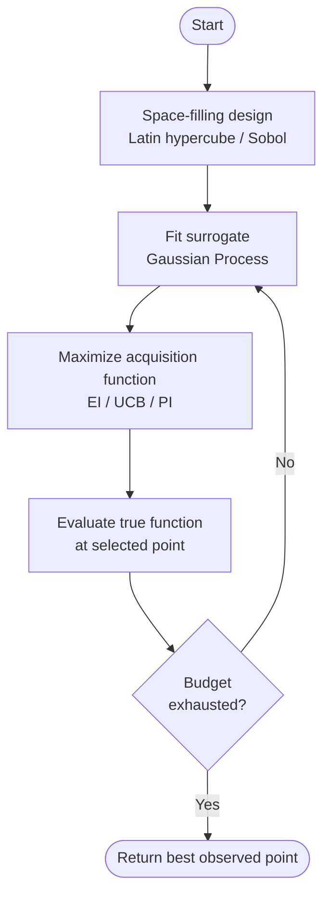
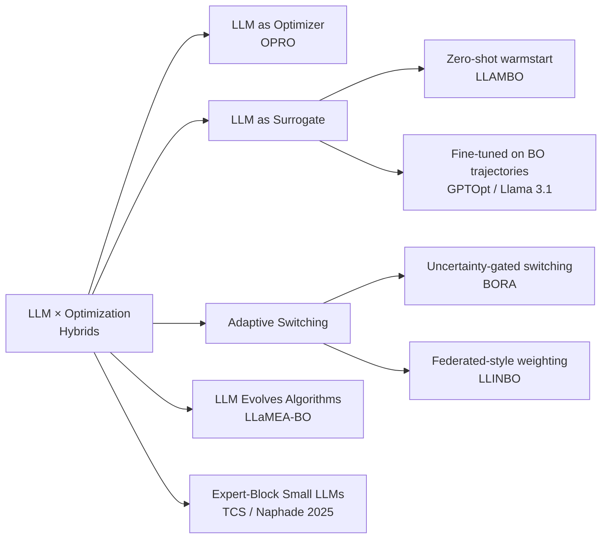
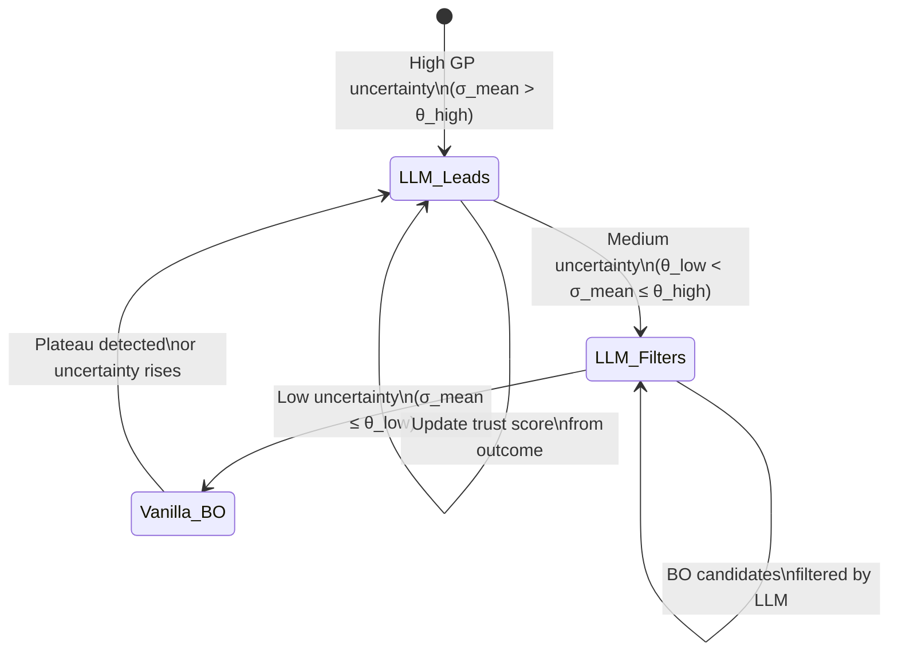
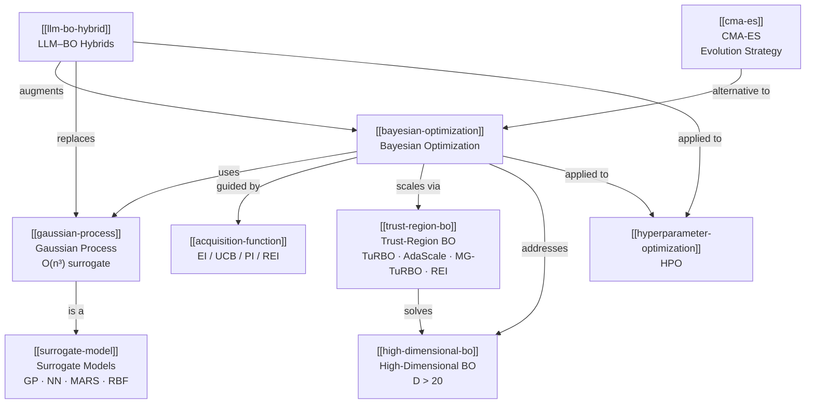
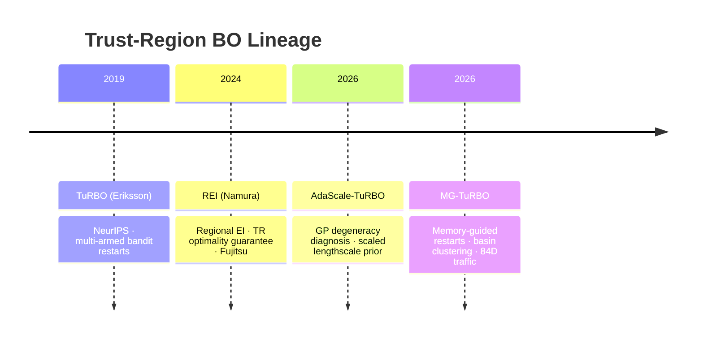
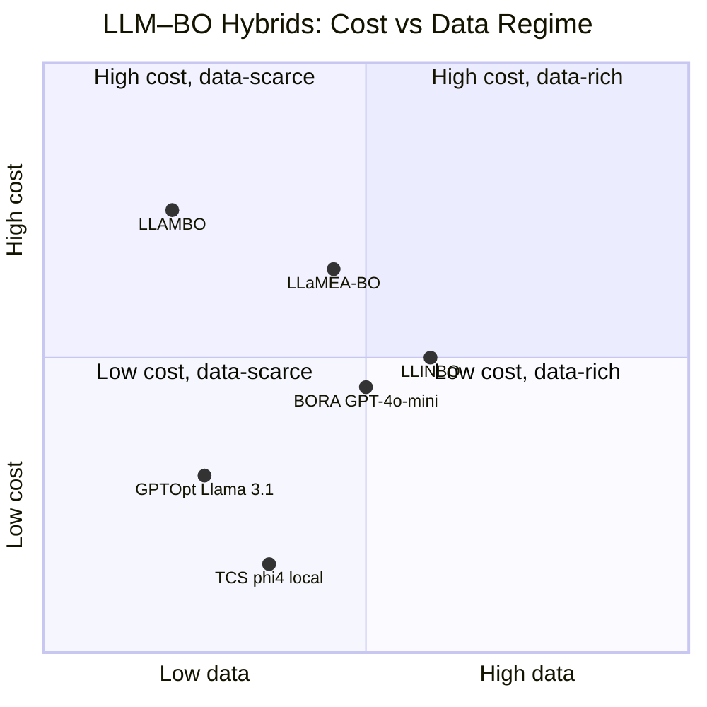

Demonstration of Mermaid diagram types using real wiki content.
Open this file in Obsidian to see rendered diagrams.

---

## 1. Flowchart — The BO Core Loop

---

## 2. Taxonomy — LLM–BO Integration Patterns

---

## 3. State Diagram — BORA Adaptive Switching

---

## 4. Concept Map — Key Relationships

---

## 5. Timeline — Trust-Region BO Evolution

---

## 6. Quadrant — LLM Surrogate Trade-offs

---

## See also

- [[bayesian-optimization]]
- [[llm-bo-hybrid]]
- [[trust-region-bo]]
- [[gaussian-process]]
- [[acquisition-function]]
