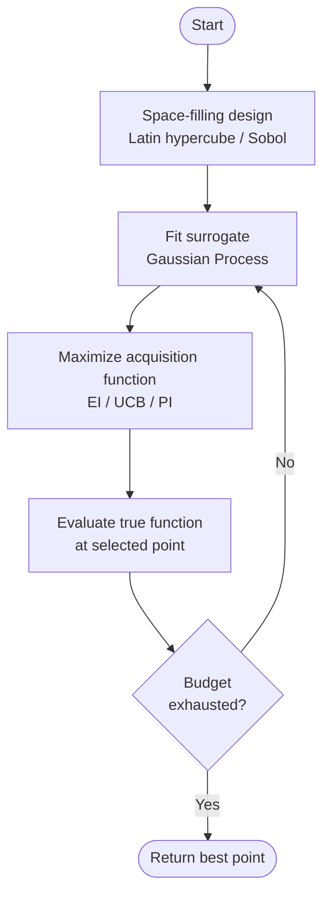

Bayesian Optimization (BO) is a sequential, model-based strategy for optimizing expensive black-box functions where gradients are unavailable. It builds a probabilistic surrogate of the objective, uses that surrogate to select the next evaluation point via an acquisition function, then refines the surrogate with the new observation.

## Core Loop

1. Initialize with a space-filling design (Latin hypercube, Sobol sequence).
2. Fit a surrogate model (typically a [[gaussian-process]]) to all observations.
3. Maximize an [[acquisition-function]] over the input space to choose the next point.
4. Evaluate the true (expensive) function at that point.
5. Add the observation and repeat.

## Strengths

- Sample-efficient: achieves good solutions in far fewer evaluations than random or grid search.
- Principled uncertainty quantification via GP posterior.
- Well-studied convergence properties for common acquisition functions.

## Limitations

- GP surrogate scales O(n³) in observations and degrades in high dimensions; see [[high-dimensional-bo]].
- Acquisition function optimization is itself a non-convex problem, increasingly hard above ~20D.
- Assumes stationarity and smoothness encoded by the kernel; may misfit highly multimodal functions.

## Key Variants

- **Global BO**: fits a single GP over the entire domain. Standard but breaks above ~20D.
- **High-dimensional BO**: additive GPs ([[wang-2018-ebo]]), trust regions ([[trust-region-bo]]), variable selection.
- **LLM-augmented BO**: LLMs replace or supplement the surrogate or acquisition step; see [[llm-bo-hybrid]].
- **Neural surrogate BO**: replaces GP with NN; see [[surrogate-model]].

## Relationship to Other Methods

[[cma-es]] is a gradient-free competitor that is often faster per iteration but less sample-efficient. For [[hyperparameter-optimization]], BO is the dominant automated method alongside random/grid search and TPE.

## See also

- [[gaussian-process]]
- [[acquisition-function]]
- [[trust-region-bo]]
- [[high-dimensional-bo]]
- [[surrogate-model]]
- [[llm-bo-hybrid]]
- [[hyperparameter-optimization]]
- [[cma-es]]
